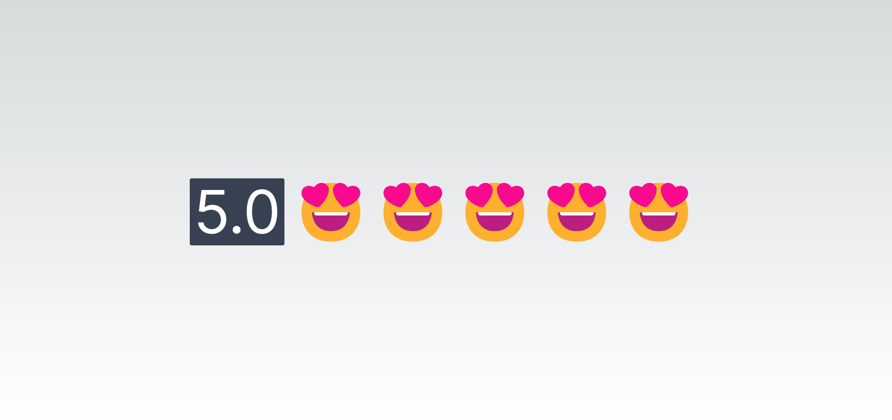

  

 

# Rating emojis
Aplicação de acordo com a nota que o usuário notificar, teremos umas carinhas diferentes dos emojis . 

 

<h3 align="center">Desenvolvido em: </h3>

  React e Typescript
 
    
    
    

 

### 📘 Ferramentas/Bibliotecas utilizadas
  - Biblioteca para criação de interfaces: `reactJS`
  - Setup para criar o projeto no React: `Next.JS`
  - Estilo: `Tailwind`
  - Biblioteca de ícones: `getemoji`
 

  
## ✔️ Autores

- [LucieneFreitas](https://github.com/LucieneFreitas)

## 📄 Referência

- [B7Web](https://alunos.b7web.com.br/)